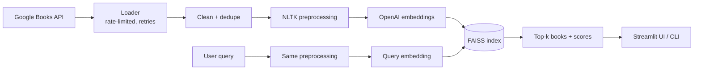

# Book Recommendation System

Semantic book search: describe what you want to read in plain language and get the closest matches from a 963-book catalogue, using OpenAI embeddings and a FAISS vector index orchestrated with LangChain.

**Stack:** Python · LangChain · OpenAI `text-embedding-3-small` · FAISS · NLTK · Streamlit · Google Books API

## Results

Evaluated on 10 varied queries, 5 recommendations each (`docs/recommendation_evaluation_summary.md`):

| Query mode | Avg. similarity | Unique titles |
|---|---|---|
| Raw query | 0.211 | 50 / 50 |
| NLTK-preprocessed query | **0.252** (+19%) | 50 / 50 |

Normalising queries the same way as the catalogue (tokenise, lemmatise, drop book-specific stop words) gave the biggest quality gain, with no loss of diversity.

## How it works



## 🏗️ Architecture Overview

### System Architecture
```
┌─────────────────┐    ┌─────────────────┐    ┌──────────────────────────────┐
│   Data Layer    │    │  Processing     │    │      Application Layer       │
│                 │    │    Layer        │    ├──────────────────────────────┤
├─────────────────┤    ├─────────────────┤    │ • Streamlit UI               │
│ • Google Books  │───▶│ • LangChain     │───▶│ • CLI Interface              │
│   API Loader    │    │   Chains        │    │                              │
│                 │    │ • Clean data    |    │ • Recommendation Service     │
|                 |    | • Text Preproc  │    │                              │
│                 │    │ • Embeddings    │    │                              │
└─────────────────┘    └─────────────────┘    └──────────────────────────────┘
```

### Data Flow
```
Google Books API → Raw Data → Text Preprocessing → OpenAI Embeddings → FAISS Vector Store → Recommendation Service → Recommendations
```

### Book store
````
Actual size of the books vector store is 963 book
````

### Modular Design
- **Core Module**: Base functionality and utilities
- **Chains Module**: LangChain processing pipeline
- **Services Module**: Algorithm and recommendation engine (Recommendation Service)
- **Interface Module**: User interaction layer

## 🚀 Quick Start

### Setup

```bash
# clone project
git clone https://github.com/Alcheemiist/Book-recommendation-system.git
cd Book-recommendation-system

# create virtual environment
python3 -m venv myenv
source myenv/bin/activate

# Install dependencies
pip install -r requirements.txt

# Create .env file
echo "OPENAI_API_KEY=your_key_here" > .env
echo "GOOGLE_API_KEY=your_key_here" >> .env
```

### Run
```bash
cd src

# Web interface (recommended)
streamlit run interface.py

# Command line
python3 main.py

# Run pipeline
python3 pipeline.py
```

## 📁 Complete Project Structure

```
Book-recommendation-system/
├── src/                                   # Main source code
|
│   ├── core/                              # Core functionality
│   │   |
│   │   ├── base_chain.py                  # Base chain with monitoring
│   │   ├── data_loader.py                 # Google Books API loader
│   │   ├── data_processor.py              # Data processing utilities
│   │   └── text_preprocessor.py           # NLTK text preprocessing
|   |
│   ├── chains/                            # LangChain processing chains
│   │   |
│   │   └── processing_chains.py           # All processing chain classes
|   |
│   ├── services/                          # Business logic services
│   │   |
│   │   └── recommendation_service.py      # Recommendation engine
|   |
│   ├── interface.py                       # Streamlit web interface
│   ├── main.py                            # CLI entry point
│   └── pipeline.py                        # Main processing pipeline
|
├── data/                                  # Data storage
|
├── book_index/                            # FAISS vector store
|
├── requirements.txt                       # Python dependencies
├── LICENSE                                # Project license
└── README.md                              # Project documentation
```

## 🔧 Core Features

### Data Collection & Processing
- **Systematic API Collection**: Multi strategy book collection from Google Books API
- **Incremental Saving**: Progress preservation with pickle files
- **Quality Filtering**: Minimum description length and duplicate removal
- **Rate Limiting**: Built-in API protection and error handling

### Text Processing Pipeline
- **NLTK Integration**: lowercase normalization, word tokenization, lemmatization, and POS tagging
- **Custom Stop Words**: Book-specific stop word removal
- **Configurable Pipeline**: Adjustable preprocessing parameters
- **Unicode Handling**: Proper text normalization

### LangChain Architecture
- **Modular Chains**: Separate chains for each processing step
- **Monitored Execution**: Built-in timing and statistics tracking
- **Sequential Pipeline**: Coordinated data flow through chains
- **Error Handling**: Graceful failure and recovery

### Vector Search Engine
- **FAISS Integration**: similarity search
- **OpenAI Embeddings**: text-embedding-3-small for embedding descriptions
- **Metadata Storage**: Efficient book information retrieval

### User Interfaces
- **Streamlit Dashboard**: Interactive web interface with real-time metrics
- **CLI Interface**: Command-line recommendation tool
- **Pipeline Management**: Interactive pipeline execution and monitoring

### Evaluation & Monitoring
- **Performance Assessment**: Automated recommendation quality evaluation
- **Statistical Analysis**: Similarity scores and diversity metrics
- **Reporting**: Detailed performance reports and suggestions
- **Health Monitoring**: System status and error tracking

## 📊 Data Files

- `data/books.csv` - Raw book data from Google Books API
- `book_index/` - FAISS vector store for fast similarity search
- `docs/` - Evaluation summary and performance reports (with / without NLTK preprocessing)

## 📊 Books Distribution

- total books : 